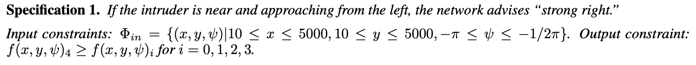
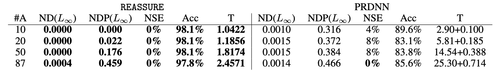

# REASSURE
[](fufeisi@bu.edu)


### This is the code implementation (pytorch) for our paper in ICLR 2022: [Sound and Complete Neural Network Repair with Minimality and Locality Guarantees](https://arxiv.org/abs/2110.07682)


REASSURE is a novel methodology for repairing neural networks that use ReLU activation functions.
Our approach applies only a localized change in the function space while still guaranteeing the removal of the buggy behavior.
By leveraging the piecewise linear nature of ReLU networks, 
our approach can efficiently construct a patch network tailored to the linear region where the buggy input resides, 
which when combined with the original network, provably corrects the behavior on the buggy input.
## Area Repairs: HCAS

We consider an area repair where the target neural network is the HCAS network which has an input layer with 3 nodes, 
5 hidden layers with 25 nodes in each hidden layer, and a final output layer with 5 nodes. 
HCAS network outputs one of five possible control advisories ('Strong left', 'Weak left', 'Clear-of-Conflict', 'Weak right' and 'Strong right').

We use the following specification to indicate the safety and compute all the linear regions that violates the specification. 
And a total of 87 buggy linear regions were found. We apply both REASSURE and PRDNN to repair these buggy linear regions. 




## Installation
Clone this repository and install the required packages.
 ```python3
 pip install -r requirements.txt
 ```

## Running Examples
Apply REASSURE on a pre-train HCAS model:
 ```python3
 python ./examples/repair.py
 ```
## Screenshot


## Cite our paper
```
@article{fu2021sound,
  title={Sound and Complete Neural Network Repair with Minimality and Locality Guarantees},
  author={Fu, Feisi and Li, Wenchao},
  journal={arXiv preprint arXiv:2110.07682},
  year={2021}
}
```
