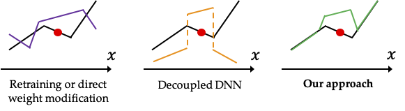
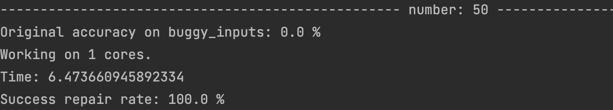

# REASSURE
[](fufeisi@bu.edu)


### This is the code implementation (in PyTorch) for our ICLR 2022 paper: [Sound and Complete Neural Network Repair with Minimality and Locality Guarantees](https://arxiv.org/abs/2110.07682)



REASSURE is a novel methodology for repairing neural networks that are continuous piecewise linear, e.g. those that use the ReLU activation function.
Our approach applies only a localized change in the function space while still guaranteeing the removal of the buggy behaviors.
Given a buggy input, 
REASSURE can efficiently construct a patch network tailored to the linear region where the buggy input resides, 
which when combined with the original network, provably corrects the behavior of the buggy input and all other unseen buggy inputs in the same linear region (thus automatically performing an area repair).

## Installation
Clone this repository and install the required packages.
 ```python3
 pip install -r requirements.txt
 ```

## Example
Use REASSURE to repair a pre-trained HCAS model (details in the paper):
 ```python3
 python ./example/repair.py
 ```
## Screenshot


## Cite our paper
```
@inproceedings{
fu2022sound,
title={Sound and Complete Neural Network Repair with Minimality and Locality Guarantees},
author={Feisi Fu and Wenchao Li},
booktitle={International Conference on Learning Representations},
year={2022},
url={https://openreview.net/forum?id=xS8AMYiEav3}
}
```
